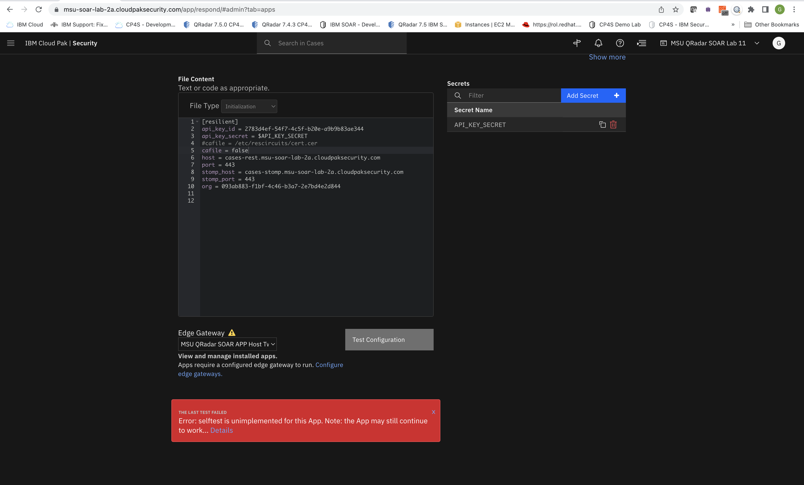
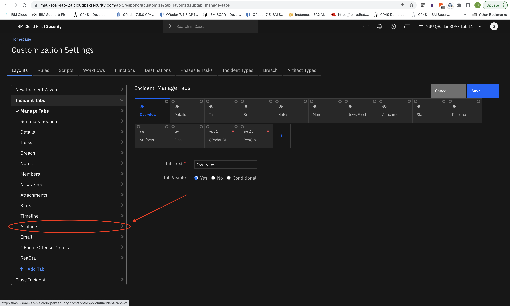
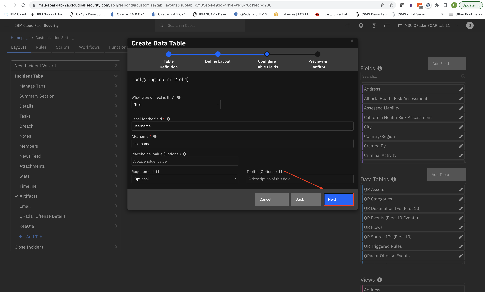
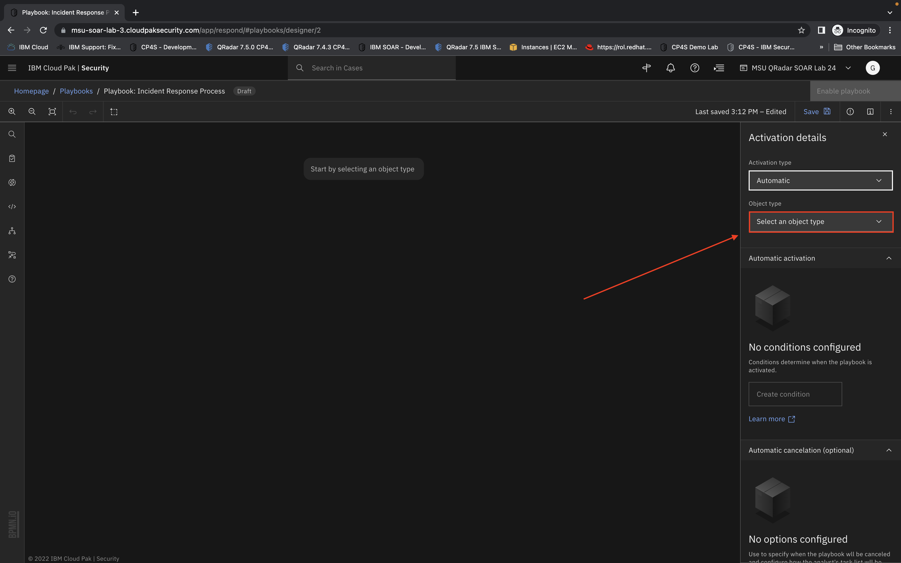
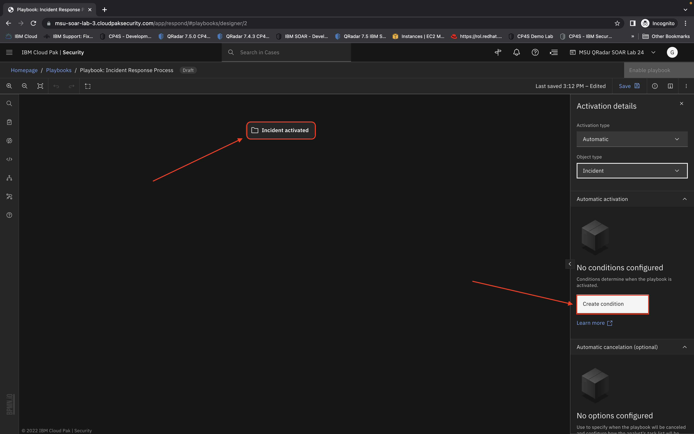
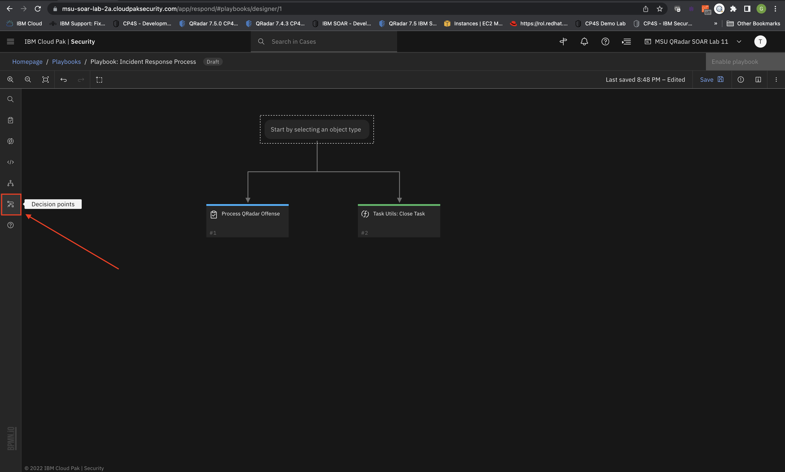
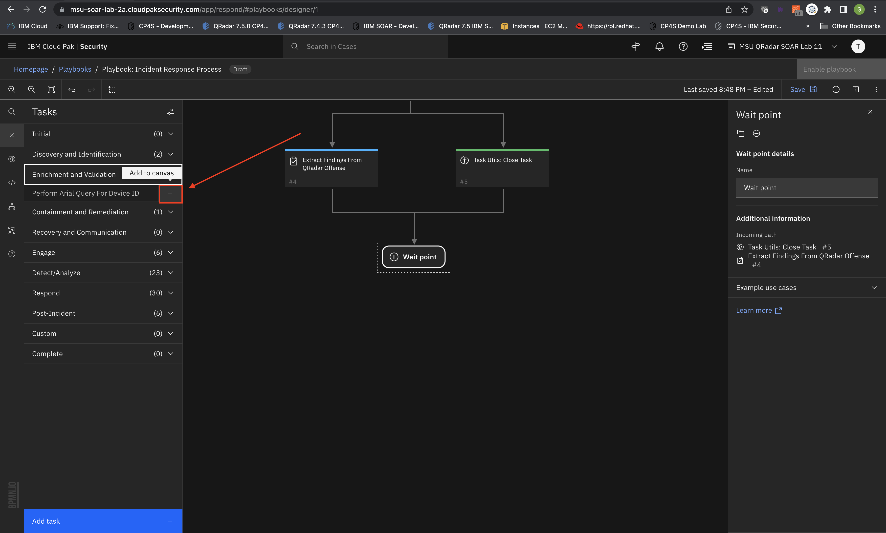
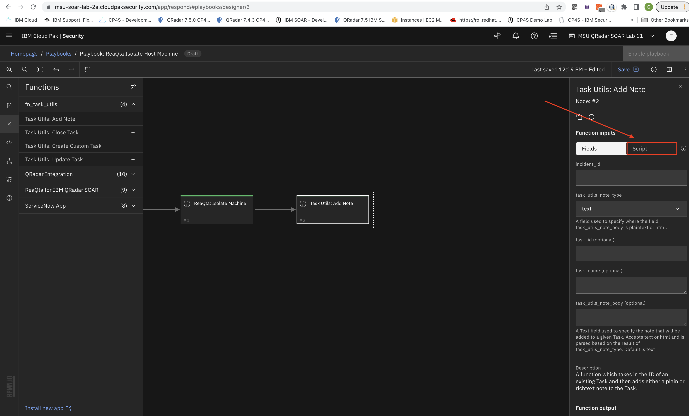
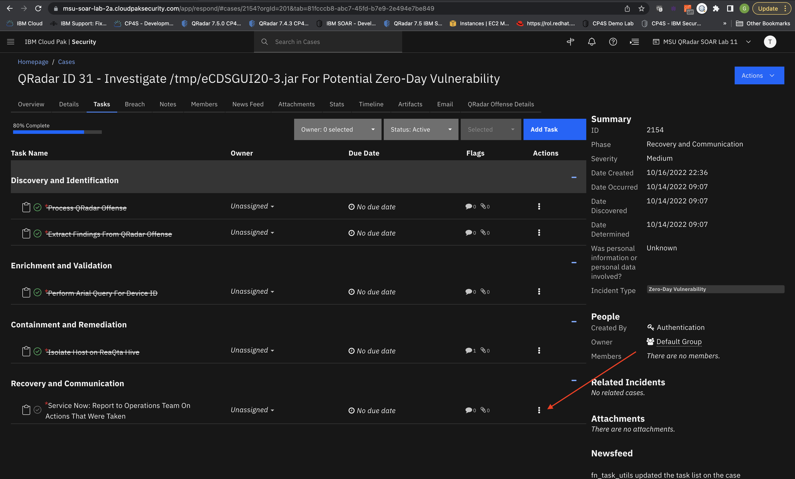

# OCP Based SOAR + Connect Workshop (Complete Guide)


***Gerald Trotman, World Wide Technical Sales Lead, Cloud Pak For Security***

---


**Table of Contents:**

  - [Part I: The Set Up](#part-i-the-set-up)
      - [Accessing SOAR + Connect Instance](#accessing-soar-+-connect-instance)
        - [Step 0: Obtaining Environment Access](#step-0-obtaining-environment-access)
      - [Configuring Permissions and Installing Apps](#configuring-permissions-and-installing-apps)
        - [Step 1: Grant Yourself Administrator Permissions](#step-1-grant-yourself-administrator-permissions)
        - [Step 2: Download QRadar Functions for SOAR from X-Force Exchange / App Exchange](#step-2-download-qradar-functions-for-soar-from-x-force-exchange--app-exchange)
        - [Step 3: Installing QRadar Functions for SOAR Application](#step-3-installing-qradar-functions-for-soar-application)
        - [Step 4: Configure QRadar Functions for SOAR](#step-4-configure-qradar-functions-for-soar-application)
        - [Step 5: Download and Installing IBM SOAR Task Helper Functions Application](#step-5-download-and-installing-ibm-soar-task-helper-functions-application)
        - [Step 6: Configure IBM SOAR Task Helper Functions Application](#step-6-configure-ibm-soar-task-helper-functions-application)
        - [Step 7: Download and Installing IBM ReaQta for IBM SOAR Application](#step-7-download-and-installing-ibm-reaqta-for-ibm-soar-application)
        - [Step 8: Configure IBM ReaQta for IBM SOAR Application](#step-8-configure-ibm-reaqta-for-ibm-soar-application)
        - [Step 9: Download and Installing ServiceNow Functions for IBM SOAR Application](#step-9-download-and-installing-servicenow-functions-for-ibm-soar-application)
        - [Step 10: Configure ServiceNow Functions for IBM SOAR Application](#step-10-configure-servicenow-functions-for-ibm-soar-application)
	  - [Data Tables](#data-tables)
        - [Step 11: Create the Data Table For QRadar Results](#step-11-create-the-data-table-for-qradar-results)
      - [Phases and Tasks](#phases-and-tasks)
        - [Step 12: Create The Phases](#step-12-create-the-phases)
        - [Step 13: Create The Tasks](#step-13-create-the-tasks)
      - [Playbook Design: Create Your Process Playbook](#playbook-design-create-your-process-playbook)
        - [Step 14: Create Playbook Scope and Conditions](#step-14-create-playbook-scope-and-conditions)
        - [Step 15: Adding Tasks, Functions, and Decision Points](#step-15-adding-tasks-functions-and-decision-points)
        - [Step 16: Add Input Logic To Our Process Playbook Function](#step-16-add-input-logic-to-our-process-playbook-function)
      - [Playbook Design: Create Your Integration Playbooks](#playbook-design-create-your-integration-playbook)
        - [Step 17: Build QRadar Search Integration Playbook](#step-17-build-qradar-search-integration-playbook)
        - [Step 18: Build ReaQta Isolate Host Integration Playbook](#step-18-build-reaqta-isolate-host-integration-playbook)
  - [Part II: The Implementation](#part-ii-the-implementation) 
      - [Putting It All Together](#putting-it-all-together)
        - [Step 19: Escalate QRadar Offense to Cases](#step-19-escalate-qradar-offense-to-cases)
        - [Step 20: Automatic Process Playbook Invoked](#step-20-automatic-process-playbook-invoked)
        - [Step 21: Perform QRadar Search For Device ID](#step-21-perform-qradar-search-for-device-id)
        - [Step 22: Isolate Host From Newly Found Device ID](#step-22-isolate-host-from-newly-found-device-id)
        - [Step 23: Create A Ticket In Service Now](#step-23-create-a-ticket-in-service-now)
      
---


# *Part I: The Set Up*

---

## Accessing SOAR + Connect Instance

### Step 0: The Environment

- To perform this lab, you will of course need an instance of **CP4S** *(now known as QRadar Suite)* as well as an instance of **QRadar SIEM** with *offenses* and the **QRadar SOAR Plugin** installed and configured. 
 
 > **Note**
 > This lab can also be used to run in QRadar SOAR Stand Alone as well but some modifications to some of these instructions.
 
- Once at the CP4S landing page, you choose the *Authentication Type* called **Enterprise SAML** as shown below:

 


- Once prompted you will be asked to provide the **IBMid**. The *convention* we will be using for each user will be:

 #### tech-bootcamp-user-X@mailinator.com

 

 where the **X** represents an assigned number you will be given that represents your login **IBMid**. So for example, if you were assigned the number **1** your **IBMid** would be:

 #### tech-bootcamp-user-1@mailinator.com   
  
- Once you have provided the appropriate **IBMid**, you will be prompted to enter the password which will be provided to you by the instructor:

 

---

## Configuring Permissions and Installing Apps  

### Step 1: *Grant Yourself Administrator Permissions*

- Once properly authenticated, you should see a screen similar to below:

 
  
 Click the three horizontal line icon in the upper left corner of the screen which should produce a large drop down menu.

- The drop down menu should look like the following:

 

 Click on **Case Management** which should produce yet another drop down menu.

- The drop down menu should look like the following:

 
 
 Click on *Permissions and access* which will bring you to the **Administrator Settings**

- The **Administrator Settings** should look like the following:

 
 
 Click on the user *Tech-Bootcamp User-X* which should then allow you to see the **User Details**.
	
 > **Note**
 > We happen to be modifying the permissions specifically for *Tech-Bootcamp User-11*.
 > Your assigned user may be different. You can choose to either use the role *Administrator* or *Master Administrator*. 

- The **User Details** for *Tech-Bootcamp User-X* should look like the following:

 

 You are going to click the blue **Edit** button on the right-hand side to allow you to modify the user permissions.
 
- You will click on the box to the right of the **Global Roles** text in the lower left-hand part of the screen which should produce a dropdown that resembles the following:

 

 Select *Master Administrator* then click the *Save* button.
 
- Your user should now have a *Master Administrator* Role and should resemble the following:

 
 
- Refresh the page and you will notice that you should now have a new tab called **Apps** and should resemble the following:

 
 
- After selecting the **Apps** tab, you should then see the following:

 

 You now have the means to pair the App Host server and install apps.

---

### Step 2: *Download QRadar Functions for SOAR from X-Force Exchange / App Exchange*

- Navigate to the IBM X-Force Exchange / App Exchange by clicking [here](https://exchange.xforce.ibmcloud.com/hub).

 

 > **Note:**
 > 
 > You will need an **IBMid** if you do not already have one to download any apps from **X-Force Exchange / App Exchange**. You can use the same credentials that have been provided to log into the CP4S account as an option as well.
 >  

- On the left hand side of the screen **Refine by** under **Brands** select **SOAR**. Then, in the *Search By Application* field, start typing *QRadar Functions* which should give you the following screen below:
 
  
  
  Click the app on the left-hand side called **QRadar Functions For SOAR**
  
- Once you are at the landing page for the application, select the blue **Download** button on the right-hand side:
 
   
   
- The download should begin and resemble below:

 
 
 You can close the **Extension Download** dialogue box. Now you are ready to install and configure the application.

 > **Note:**
 > 
 > The download contents will live wherever your browser defaults to. In this example, the download went to the *Downloads* folder using *Chrome* on a *Mac* computer.
 >    

---

### Step 3: *Installing QRadar Functions For SOAR Application* 

- Back in the *SOAR + Connect* Platform under **Administrator Settings** with the **Apps** tab selected, press the blue **Install** button:

 

- This kicks off the **Install App Wizard**. Click on the blue **Select a file** button:

 

- This prompts you to your local machines file browser where you will have to navigate to where the `app-fn_qradar_integrations-2.2.x-xxxxx.zip` was downloaded from your browser:

 

 > **Note:**
 > 
 > The application version may have changed since the time of writing this document.
 >

- Once you have selected the file, you will need to upload the file by clicking the blue **Upload File** button:

 


- Upon successful upload, the **Install App Wizard** displays the *Package Information*. You then click the blue **Next** button to continue:

 

- The **Install App Wizard** next displays the *API Key Permissions* as well as the *Package Contents* before implementing the install. Click the blue **Install** button to continue:

 
 
- Upon successful installation, you should see a screen that resembles below:

 

 You are now ready to move on and cofigure the *QRadar Functions For SOAR* application by clickin the grey **Close** button.

---

### Step 4: *Configure QRadar Functions For SOAR Application*

- Once closed the **Install App Wizard** should bring you to the *Details* tab of the newly downloaded application. Click onto the *Configuration* tab:

 

- The *Configuration* tab should resemble the following:

  
 
 Click on the `app.config` file to bring you to the *App Setting / app.config* screen.
 
- The *App Settings / app.config* page should resemble the following:

  
 
 Scroll to the bottom so we can point our application to our *Edge Gateway*.

- To configure the *Edge Gateway* click the **Choose edge gateway** demonstrated below:

 

- It should produce a menu drop-down with only one option. Select it.

 

 So it resembles this:
 
 	
 > **Note:**
 >
 > Your *Edge Gateway* name may be different than the example. Regardless, you should only have one option. 
 >

-  Next, you need to modify the `app.config` file itself so that it points to what you are integrating with properly. You will need to modify the following fields for the **QRadar Functions For SOAR**:

 

- Replace the first highlighted box so it resembles the following:
 
 ```bash
 [fn_qradar_integration:SOAR_Plugin_Destination_Name1]
 host = <replace-me-with-provided-qradar-ip>
 username = admin
 qradarpassword = Pass4Admin
 #Note, if both qradarpassword and qradartoken are given, password will be used
 #qradartoken = changeme
 verify_cert = false
 
 #Note: the QRadar instance name that you want to communicate with, must equal the
 #QRadar Destination Name that is set when configuring the SOAR Plugin
 #[fn_qradar_integration:SOAR_Plugin_Destination_Name2]
 #host = localhost
 #username = admin
 #qradarpassword = changeme
 #Note, if both qradarpassword and qradartoken are given, password will be used
 #qradartoken = changeme
 #verify_cert = false|/path/to/cert
 ```
- Replace the second highlighted box so that it resembles the following:
 
 ```bash
 cafile = false
 ```
 
- Last but not least, click the **Test Configuration** button. Upon successful completion, you should see the following:

 
 
 
- Next, scroll up to the top of the screen and click the blue **Save and Push Changes** button for the settings to take effect on the newly deployed application.

 
 
- After pushing those changes, you will be brought to the following screen:

 
 
 Click the *Details* tab to finish the application deployment process.
 
- Back at the *Details* tab of the application, press the grey **Deploy** button at the bottom:

 
 
-  This should then prompt the **Status** to change to *Deploying...* in the upper left corner:

 
 
- Upon successful deployment, the status will then change to *Ready For Use!*:

 
 
- The **QRadar Functions For SOAR** Application is now successfuly installed.

 

---

### Step 5: *Download and Installing IBM SOAR Task Helper Functions Application* 

- Navigate to the IBM X-Force Exchange / App Exchange by clicking [here](https://exchange.xforce.ibmcloud.com/hub).

 

- On the left hand side of the screen **Refine by** under **Brands** select **SOAR**. Then, in the *Search By Application* field, start typing *tasks* which should give you the following screen below:
 
  
  
  Click the app called **IBM SOAR Task Helper Functions**.

> **Note:**
> 
> For complete steps on how to install the **IBM SOAR Task Helper Functions**, please refer to the previous **Step 2** and **Step 3** of this guide.

---

### Step 6: *Configure IBM SOAR Task Helper Functions Application*

- Navigate to the *App Setting / app.config* page of the **IBM SOAR Task Helper Functions**, click the *Configuration* tab and then the `app.config` file.

-  Modify the `app.config` file.

 

- Replace the highlighted box so that it resembles the following:
 
 ```bash
 cafile = false
 ```

- Click the **Test Configuration** button then wait for the test to complete:

 

 > **Note:**
 > 
 > The test fails but don't worry, it should still work for this lab. As noted, the self test was not implemented for this application.

-  Click the blue **Save and Push Changes** button in the upper right corner.

- Click the *Details* tab to finish the application deployment process.

- Press the grey **Deploy** button at the bottom.

- The **IBM SOAR Task Helper Functions** Application is now successfully installed. 

> **Note:**
> 
> For complete steps on how to configure the **IBM SOAR Task Helper Functions**, please refer to the previous **Step 4** of this guide.

---

### Step 7: *Download and Installing IBM ReaQta for IBM SOAR Application*

- Navigate to the IBM X-Force Exchange / App Exchange by clicking [here](https://exchange.xforce.ibmcloud.com/hub).

 

- On the left hand side of the screen **Refine by** under **Brands** select **SOAR**. Then, in the *Search By Application* field, start typing *reaqta* which should give you the following screen below:
 
  
  
  Click the app called **IBM ReaQta for IBM SOAR**.

> **Note:**
> 
> For complete steps on how to install the **IBM ReaQta for IBM SOAR**, please refer to the previous **Step 2** and **Step 3** of this guide.

---

### Step 8: *Configure IBM ReaQta for IBM SOAR Application*

- Navigate to the *App Setting / app.config* page of the **IBM ReaQta for IBM SOAR**, click the *Configuration* tab and then the `app.config` file.

-  Modify the `app.config` file.

 

- Replace the highlighted box so that it resembles the following:
 
 ```bash
 [fn_reaqta]
 polling_interval = 60
 polling_lookback = 1440
 # comma separated list of hives to poll: poller_hives = hive_label1, hive_label2
 polling_hives = rhiveam
 # comma separated list of hives to set a policy if not specified from the SOAR app
 policy_hives = rhiveam
 # Optional override value for templates used for creating/updating/closing SOAR cases
 #soar_create_case_template=
 #soar_close_case_template=
 # For an integration server, specify the proxy settings here.
 # For AppHost, use the manageAppHost proxy capability.
 #http_proxy=
 #https_proxy=
 # specify a timeout value for access to ReaQta. Default is 60 seconds
 timeout = 60

 [fn_reaqta:rhiveam]
 # repeat this section for as many hives as you need to specify
 api_key = 2367ab3b-5163-4460-b79e-c682d53deee7
 api_secret = VdmSH3v4xzpT7RnEHeuLDpkn
 reaqta_url = https://rhiveam.techzone.ibm.com/
 api_version = rqt-api/1/
 cafile = false

 #
 # set filters for the poller. Ex: "severity": ["medium", "high"], "tag": ["hive"]
 #   additional filtering can be done by groups and impact (greater or equal to numeric value):
 #      polling_filters="groups": ["groupA", "groupB"], "impact": 70
 #polling_filters="severity": ["low", "high"], "tag": ["hive"]
 ```

 > **Note:**
 > 
 > You did not necessarily need to set `cafile = false` under the `[resilient]` section. But if it fails for some reason, try doing so and running the test again.
 >
 
- Click the **Test Configuration** button then wait for the test to complete:

 


-  Click the blue **Save and Push Changes** button in the upper right corner.

- Click the *Details* tab to finish the application deployment process.

- Press the grey **Deploy** button at the bottom.

- The **IBM ReaQta for IBM SOAR** Application is now successfully installed. 

> **Note:**
> 
> For complete steps on how to configure the **IBM ReaQta for IBM SOAR**, please refer to the previous **Step 4** of this guide.

---

### Step 9: *Download and Installing ServiceNow Functions for IBM SOAR Application*

- Navigate to the IBM X-Force Exchange / App Exchange by clicking [here](https://exchange.xforce.ibmcloud.com/hub).

 

- On the left hand side of the screen **Refine by** under **Brands** select **SOAR**. Then, in the *Search By Application* field, start typing *snow* which should give you the following screen below:
 
 
  
 Click the app called **ServiceNow Functions for IBM SOAR**.

> **Note:**
> 
> For complete steps on how to install the **ServiceNow Functions for IBM SOAR**, please refer to the previous **Step 2** and **Step 3** of this guide.

---

### Step 10: *Configure ServiceNow Functions for IBM SOAR Application*

- Navigate to the *App Setting / app.config* page of the **ServiceNow Functions for IBM SOAR**, click the *Configuration* tab and then the `app.config` file.

-  Modify the `app.config` file.

 

- Replace the highlighted box so that it resembles the following:

 ```bash
 [fn_service_now]
 sn_host = https://ven02807.service-now.com
 sn_api_uri = /api/x_ibmrt_resilient/api
 # Name of the table in ServiceNow to sync with.
 # as of v2.0.0 the incident table and the sn_si_incident table are supported
 # (NOTE: ServiceNow Security Incident Response module is required for sn_si_incident)
 sn_table_name = incident
 # Username + Password of ServiceNow Integrator user who has the the "x_ibmrt_resilient.integrator"   role
 sn_username = gtrotman
 sn_password = mails66,cram
 ```

- Click the **Test Configuration** button then wait for the test to complete:

 

-  Click the blue **Save and Push Changes** button in the upper right corner.

- Click the *Details* tab to finish the application deployment process.

- Press the grey **Deploy** button at the bottom.

- The **ServiceNow Functions for IBM SOAR** Application is now successfully installed. 

> **Note:**
> 
> For complete steps on how to configure the **ServiceNow Functions for IBM SOAR**, please refer to the previous **Step 4** of this guide.

---

## Data Tables

### Step 11: *Create the Data Table For QRadar Results*

- Click the icon in the upper left most corner of the screen to produce the main **Menu** drop down:
 
 

- From there under *Application Settings*, select **Case Management** and then **Customization**:
 
 

- At the **Customization  Settings**, under **New Incident Wizard**, select **Incident Tabs**:

 

- The **Incident Tabs** produces a drop down menu. Select **Artifacts**
 
 

- Click the grey **Add Table** button to kick off the **Create Data Table** install wizard:

 

- For the *What is the label for this table?* field add: **QRadar Results With Device ID**: 
 
 
 
 Click the blue **Next** button to proceed.
 
 > **Note:**
 > The label name for the Data Table creates an *API Name* automatically in the field below it.
 >
 >

- For column names, add: **Start Time**, **Log Source**, **Device ID**, and **Username** exactly as it appears below: 
 
 

 Click the blue **Next** button to continue.
 
- The **Create Data Table** install wizard next takes you through *Configuring columns* 1 through 4. Just click the blue **Next** button as we will not be making any modifications: 
 
 
 
 
 

- Click the blue **** button to finish confirming the creation of the Data Table.
 
 

- The data table is now created and will be referenced shortly there after in the lab:

 
 
---

## Phases and Tasks

### Step 12: *Create The Phases*

- Click the three horizontal line icon in the upper left corner which should produce a large drop down menu.

 

- In the menu drop down, select the label marked **Case Management** which will produce yet another drop down menu.

 

- Under the **Case Management** drop down, select **Customization** which will bring you to a new page:
 
 

- Once at the **Customization** page, you will then need to click on the **Phases & Tasks** tab:

 

- Next, click the grey **Create Phase** button to begin creating our own custom phases for this lab:

 

- Create a phase for *Discovery and Identification* then click the blue **Create** button:

 

- Create a phase for *Enrichment and Validation* then click the blue **Create** button:

 

- Create a phase for *Containment and Remediation* then click the blue **Create** button:

 

- Create a phase for *Recovery and Communication* then click the blue **Create** button:

 

- Once the phases have been created, you must rearrange them towards the top for priority:

 
 
 > **Note:**
 > 
 > The instructions are highlighted for how to rearrange the phases. 

- Implemented successfully, they should resemble this:

  
 
 Now we are ready to create some Tasks.

---

### Step 13: *Create The Tasks*

- While still in the **Customization Settings** page, select the blue **Create Tasks** button.

  

- First, select the **Discovery and Identification** phase under the *Phase* drop down.

 

- Name the task next to the *Task Name* field: **Process QRadar Offense**

 

 Click the blue **Save & Close** button and continue.

- While still in the **Customization Settings** page, select the blue **Create Tasks** button.

 

- Again, select the **Discovery and Identification** phase under the *Phase* drop down.

 

- Name this task next to the *Task Name* field: **Extract Findings From QRadar Offense**

 

 Click the blue **Save & Close** button and continue.
 
- While still in the **Customization Settings** page, select the blue **Create Tasks** button.

  

- This time, select the **Enrichment and Validation** phase under the *Phase* drop down.

 

- Scroll down to the lower right corner of the screen. Under **Data Tables** scroll till you see the Data Table named **QRadar Results With Device ID**
 
 

- Click on the Data Table named **QRadar Results With Device ID** and then drag and drop it into the large *Task Layout* field:

 

- Successful completion of the **QRadar Results With Device ID** data table being added should resemble the following:
 
 

- Name this task next to the *Task Name* field: **Perform Arial Query For Device ID**

 

 > **Warning:**
 > 
 > Make sure there are no trailing white spaces in the *Task Name* field or the **Task Utils: Close Task** Function will not work!

 Click the blue **Save & Close** button and continue.

- Still in the **Customization Settings** page, select the blue **Create Tasks** button.

  

- This time, select the **Containment and Remediation** phase under the *Phase* drop down.

 

- Scroll down to the lower right corner of the screen. Under **Data Tables** scroll till you see the Data Table named **QRadar Results With Device ID**
 
 

- Click on the Data Table named **QRadar Results With Device ID** and then drag and drop it into the large *Task Layout* field:

 

- Again, successful completion of the **QRadar Results With Device ID** data table being added should resemble the following:
 
 

- Name this task next to the *Task Name* field: **Isolate Host on ReaQta Hive**

 

 > **Warning:**
 > 
 > Make sure there are no trailing white spaces in the *Task Name* field or the **Task Utils: Close Task** Function will not work!

 Click the blue **Save & Close** button and continue. 
 
- Finally, in the **Customization Settings** page, select the blue **Create Tasks** button.

 
 
- This time, select the **Recovery and Communication** phase under the *Phase* drop down.

 
 
- Name this task next to the *Task Name* field: **Service Now: Report to Operations Team On Actions That Were Taken**

 
 
 Click the blue **Save & Close** button and continue. Now, we are ready to create some playbooks using **Playbook Designer**.

---

## Playbook Design: Create Your Process Playbook

### Step 14: *Create Playbook Scope and Conditions*

- Click the three horizontal line icon in the upper left corner which should produce a large drop down menu: 

 

- Click the menu item called **Case Management** which should produce yet another drop down menu:

 

- In that drop down menu, you will see a menu item **Playbooks**. Click it to bring you to the **Playbook Designer** page.

 

- At the **Playbooks** page, click the blue button **Create playbook** to begin creating our first playbook.

 

- The canvas starts with the first node asking you to *Start by selecting an object type*. Under **Activation details** click the **Select an activation type** menu drop down:

 

- For this particular playbook we want to set *activation type* to **automatic**:

  

- Next, click the **Select an object type** menu drop down:

  

- Since we want the scope of the playbook to run on an *Incident* level select **Incident** in the menu drop down:

  

- You should see the following:

 

 Next, click the **Create condition** button.

- This will bring you to the *Create Condition* page with a default condition. Click the **Incident is created** menu drop down under *Condition builder*.

  

- Under the drop down is also a search field. In it, begin typing *Incident Type* as seen below:

 

- This bolts on another lateral menu drop down. Change it to **is equal to** as portrayed below:

 

- This then adds on a lateral multi-select field. Begin typing *Zero* into the field, select the **Zero-Day Vulnerability** drop down option and then the blue **Done** button to finish creating our condition for our playbook.

 

- Now that our condition is set, we are now ready to create our playbook.

   

---

### Step 15: *Adding Tasks, Functions, and Decision Points*

- The Playbook begins with adding tasks to the canvas and attaching it to the starting node. Click on the icon that resembles a clip board on the left hand side depicted below:

 

 > **Note:**
 > 
 > Hovering the cursor over the icons tell you what each icon represents as displayed above. 
 
- This opens up the **Task** view which displays a list of phases. Click **Discovery and Identification** which produces a menu drop down:

 

- Next, click the **+** icon next to task called **Process QRadar Offense** which will then bring the task object to the canvas.

 

- This then adds the **Process QRadar Offense** Task as node to the canvas:

 

- Begin to rearrange the nodes similar to below by clicking and dragging them:

 

 > **Note:**
 > 
 > When you click on a node you will see blue circles appear. It means that you can drag a conneted line from one node to another. 
 >
  
-  From one of the blue circles around whichever node you decide to click on, drag a connection line from node to another so that it resembles below:

 

- Close the **Task** menu:

 

 > **Note:**
 > 
 > This is not a mandatory step to get to the next. It was purely for instructional purposes. 
 >

- Next, you will click on the **Functions** icon as shown below:

 

- This will open a menu of available **Functions**. Click the one called **`fn_task_utils`** which will then produce a familiar drop down menu:

 
 
- Click the **+** button next to the Function named **Task Utils: Close Task**

 
 
- This then adds the **Task Utils: Close Task** Function as node to the canvas: 

 

- Rearrange the function node as shown below:

 
 
- Connect the starting node to the **Task Utils: Close Task** Function node so it resembles similar to below:
 
 

- Close the **Functions** menu:  
 
 

- Next, click on the icon that represents **Decision points** as shown below that will open up a menu view:
 
 

-  Under the **Wait Point** section of the menu, select the **+** icon to add the **Wait Point** node to the canvas:
 
 

- This then adds the **Wait Point** to the canvas:
 
 

- Rearrange the **Wait Point** and then connect it to the **Process QRadar Offense** Task node:
 
 

- Then, connect the **Task Utils: Close Task** Function node to the **Wait Point** node as shown below:
 
 

- Close the **Decision points** menu:
 
 
 
- Click the **Task** icon again (the one that looks like a clipboard), and then **Discovery and Identification** which displays a drop down menu:
 
 

-  Click the **+** button next to the Task that says **Extract Findings From QRadar Offense**
 
 

-  This will add the **Extract Findings From QRadar Offense** Task node to the canvas. Rearrange the Task node and connect it to the **Wait Point** node as shown below:
 
 

 Close the **Task** menu.

- Again, click on the icon that represents **Functions** as shown below:

 

 This will again open a menu of available **Functions**. Click the one called **`fn_task_utils`** which will then produce a familiar drop down menu.

- Again, click the **+** button next to the Function named **Task Utils: Close Task**
 
 

- You should again see another **Task Utils: Close Task** Function node appear on the canvas:

 

- Rearrange the **Task Utils: Close Task** Function node and connect it to the **Wait Point** node as shown below:

 

 Close the **Functions** menu.

- Again, click on the icon that represents **Decision points**. Once the menu opens, click the **+** icon associated with the **Wait point** which will then appear on canvas as shown:

 

- Rearrange the **Wait point** and connect it to the two nodes as displayed below:

 

- Close the **Decision Point** menu 

 
 
- Click the **Task** icon again (the one that looks like a clipboard). But this time click **Enrichment and Validation** which displays a drop down menu:
 
 
 
- Click the **+** button next to the drop down option that says **Perform Arial Query For Device ID**. 
 
 
 
- This of course then adds the **Perform Arial Query For Device ID** Task node to the canvas:

 

- Rearrange and connect the **Perform Arial Query For Device ID** Task node to the **Wait point** node as shown below: 
 
 
- While still in the **Task** drop down menu, click **Containment and Remediation**

 

- Click the **+** button next to the drop down option that says **Isolate Host on ReaQta Hive**. This adds the **Task** node to the canvas as shown below:
 
 
  
- Rearrange and connect the **Isolate Host on ReaQta Hive** Task node to the previous **Perform Arial Query For Device ID** Task node as shown below: 
 
 
 
- Next, while still in the **Task** drop down menu, click **Recovery and Communication**, then the **+** button next to the Task that says **Service Now: Report to Operations Team On Actions That Were Taken** which then adds that Task node to the canvas as shown:

 
  
- Rearrange and connect the **Service Now: Report to Operations Team On Actions That Were Taken** Task node to the **Isolate Host on ReaQta Hive** Task node as shown:

 

- You can finally close out the **Task** window.

 

- Click the icon that represents the **Decision points** as shown below which will open up a menu view:
 
 
 
- Click the **+** icon opposite the **End point** to add it to the canvas:
 
 

- The **End point** Decision node gets added:

 

- Rearrange the **End point** node and attach it after the **Service Now: Report to Operations Team On Actions That Were Taken** Task node to the **Isolate Host on ReaQta Hive** node to complete our process playbook.

 

- Now we have completed the structure for our **Process Playbook**. Here represents a birds eye view of our flow:
 
 

 > **Note:**
 > 
 > All though it saves, note that there are a couple of nodes that are throwing errors. We are going to address this in our next step. 
 >

---

### Step 16: *Add Input Logic To Our Process Playbook Function*

- We start by clicking the first Function node in the upper right. When selected, it displays a screen on the right-hand side of the screen. By default the **Function Inputs** view is set to *Fields*:  

 
 
 We are going to set it to *Script*.
 
- Once set to *Script* you will be brought to the **Add Script** screen.
 
 

- First, toggle the programming language to **Python 2**
 
 
 
- Once set, it should resemble the following:
 
 
 
- You will then add the following lines of code:

 ```bash
 inputs.incident_id = str(incident.id)
 #inputs.task_id = task.id
 inputs.task_name = "Process QRadar Offense"
 ``` 
 It should resemble the following:
 
 

 Click save to close you out of the **Add Scripts** window and back to the canvas.
 
- To complete the configuration of a Function, it needs to have a declared **Function Output**. Name it `task_output_one` as shown below:

 
 
 > **Note:**
 > 
 > We will not be using this function output name in this example so it doesn't really matter what it gets called. 
 >

- Now we need to set the other Function node parameters. Click on the second Function node in the lower right. Again, it will display a screen on the right-hand side with *Fields* set as the **Function Inputs** view by default:   

 

- Toggle the view to *Scriprts* which again brings you to the **Add Scripts** screen where you will need to change the language from **Python 3** to **Python 2** as seen below:

 
 
- Next, add the following lines of code:

 ```bash
 inputs.incident_id = str(incident.id)
 #inputs.task_id = task.id
 inputs.task_name = "Extract Findings From QRadar Offense"
 ``` 
 
 Again, it should resemble the following:
 
 
 
 Click save to close you out of the **Add Scripts** window and back to the canvas.

- Under **Function Output**, add `task_output_two` in the field as shown:
 
 
 
 Then click save in the upper right corner. 

- Upon saving the playbook, you should see a **Success** message at the bottom of the screen with no more errors to have to resolve.  

 
 
 Click the blue **Enable playbook** button in the upper right corner of the screen.

- You will then see a dialogue box that reminds you of the implications of enabling a playbook.

 
 
 Click the blue **Enable** button to continue.

- You should then see another **Success** banner across the botton of the screen. Your *Process Playbook* is now ready to be used. 
 
 
 
 Click the **Playbooks** text in the upper left corner to bring you to the **Playbooks** page.
 
---

## Playbook Design: Create Your Integration Playbooks
 
### Step 17: *Build QRadar Search Integration Playbook*

- From the **Playbook** page, we start by clicking the blue **Create playbook  +** button in the right side of the screen: 
 
 
 
- We need to give the playbook a name as done in a previous step. Add **Playbook: QRadar Ariel Query For Initial Findings** under the *Name* field then click the blue **Create** button at the bottom.
 
 

- You are then brought to a Playbook canvas screen with an open **Activation Details** menu on the right. Click the **Select an activation type** under *Activation type* which will produce a drop down:
 
 

- For this particular playbook we are creating, choose **Manual** from the menu drop down.
 
 

- Next, click the **Select an object type** menu under *Object type* which will produce a drop down menu:
 
 

- The *Object type* drop down produces the following options:

 

- Since the scope of our playbook will be manually run on an *Incident* level, we will be setting the *Object Type* to **Incident** in the drop down:
 
 

- You should then see that the starting node is set to **Incident activated**. Next, click on the icon that represents **Functions** as shown below:
  
 

- You should then see the **Functions** view. Click on **QRadar Integration** which will then produce a drop down menu of 10 items:

 
 
- Click the **+** icon next to the menu item named **QRadar Search**:

 

- This will then bring the **QRadar Search** node to the canvas:

 

- Close the **Function** window view:

 
 
- Rearrange and connect the starting node to the **QRadar Search** node as shown below:

 
 
 Then, toggle the *Functions inputs* view to **Script**

- You will be presenting with a dialogue box. Click the blue button that says **Continue to script**:

 
 
- For our script, we are going to need to toggle from **Python 3** to **Python 2**:

 

- Then, we will add our input script logic for our **QRadar Search** Function with the following:

 ```bash
 inputs.qradar_label = "SOAR_Plugin_Destination_Name1"
 inputs.qradar_query = """SELECT QIDNAME(qid) as 'Event Name',logsourcename(logSourceId) as 'Log Source',"eventCount" as 'Event Count',"startTime" as 'Time',categoryname(category) as 'Low Level Category',"sourceIP" as 'Source IP',"sourcePort" as 'Source Port',"destinationIP" as 'Destination IP',"destinationPort" as 'Destination Port',"userName" as 'Username',"magnitude" as 'Magnitude', "Fakeware_Username" as 'Fakeware_Username', "Fakeware_Device_Id" as 'Fakeware_Device_Id' from events WHERE INOFFENSE(%param2%) LAST 25 DAYS"""
 #inputs.qradar_search_param1 = "DATEFORMAT(starttime, 'YYYY-MM-dd HH:mm') as StartTime, CATEGORYNAME(category), LOGSOURCENAME(logsourceid), PROTOCOLNAME(protocolid), RULENAME(creeventlist)"
 inputs.qradar_search_param2 = incident.properties.qradar_id
 ``` 
 It should look similar to below:
 
 

 Click the blue **Save** button to continue.

- All **Functions** require an output name whether it gets used or not. Name the *Output name*: `qradar_output` as shown below  

 

- Next, click the icon shown below that represents **Scripts**
 
 

- This opens the **Scripts** view. Click the blue **Create script** button at the bottom of the screen as shown:
 
 

- This brings you to the **Create script** compiler user interface.
 
 

- Add the following code:

 ```python:
 q_o = playbook.functions.results.qradar_output
 
 for event in q_o.events:
 	qradar_event = incident.addRow("qradar_results_with_device_id")
 	#qradar_event.start_time = event['Time]
 	qradar_event.log_source = event['Log Source']
 	qradar_event.device_id = event['Fakeware_Device_Id']
 	qradar_event.username = event['Fakeware_Username']
 ```
 
 The script should resemble the following below:
 
 
 
 Click the blue **Create** button at the bottom right corner.
 
- Next, under the **Local script** drop down, click the **+** next to the **QRadar Arial Query Return Results**:
      
 

- This adds the **QRadar Arial Query Return Results** Script node to the canvas as shown:
 
 

- Connect the **QRadar Arial Query Return Results** Script node to the **QRadar Search** function node.
 
 
 
- Next, we need to add another function to the canvas. Click the icon on the left that represents **Functions**:

 

- Under the **Functions** view click on **`fn_task_utils`** which creates a drop down menu. Click the **+** icon next to the Function named **Task Utils: Close Task** as shown:

 

- This adds the **Task Utils: Close Task** Function node to the canvas:
	
 

- Rearrange and connect the **QRadar Arial Query Return Results** Script node to the **Task Utils: Close Task** Function node as shown:

 

 Click **Scripts** under *Function Inputs* on the right hand side.

- First thing we do in the **Add Script** window is we toggle the setting to **Python 2**:

 

- Next, we add the following lines of code:
 
 ```bash
 inputs.incident_id = str(incident.id)
 #inputs.task_id = task.id
 inputs.task_name = "Perform Arial Query For Device ID"

 ``` 
 It should resemble this:
 
 
 
 Click the blue **Save** button at the bottom right corner.

- Name the *Output name* under **Function Output** on the right: **`task_output`**
 
 
 
 Then on the left, click the icon that represents **Decision Points**
 
- In the **Decision Points** view, click the **+** under **End point**.

 

- The **End point** node will then be added to the canvas as shown below:

 

- Rearrange and connect the **Task Utils: Close Task** Function node to the **End point** node as shown:

 

 You can now close the **Decision Points** view.

- Make sure to save your changes by clicking the **Save** button in the upper right:

 

 Once the save is successful, click the blue **Enable playbook** button.

- You will see a dialogue box regarding enabling the playbook. Click the blue **Enable** button.
 
 

- Your QRadar Search Integration Playbook is now complete!

 

 Click the *Playbook* text to bring you back to the **Playbooks Library**.
 
---

### Step 18: *Build ReaQta Isolate Host Integration Playbook*

- From the **Playbook** page again, we start by clicking the blue **Create playbook  +** button in the right side of the screen:

 

- We need to give the playbook a name as done in a previous step. Add **Playbook: ReaQta Isolate Host Machine** under the *Name* field then click the blue **Create** button at the bottom.

 

- You are then brought to a Playbook canvas screen with an open **Activation Details** menu on the right. Click the **Select an activation type** under *Activation type* which will produce a drop down:
 
 

- For this particular playbook we are creating, choose **Manual** from the menu drop down.
 
 

- Next, click the **Select an object type** menu under *Object type* which will produce a drop down menu:
 
 

- The *Object type* drop down produces the following options:

 

- Since the scope of our playbook will be manually run on a *Data Table* level this time, we will be setting the *Object Type* to **Data Table** in the drop down:
 
 

- We need to specify which **Data Table** to invoke the action agains. Click the **Select a data table** menu which will produce a drop down:

 

- From the **Select a data table** drop down options, select the **QRadar Results With Device ID** option:

 
 
- You should then see that the starting node is set to **Data Table activated**. Next, click on the icon that represents **Functions** as shown below:
  
 

- You should then see the **Functions** view. Click on **ReaQta for IBM QRadar SOAR** which will then produce a drop down menu of 9 items:

 
 
- Click the **+** icon next to the menu item named **ReaQta: Isolate Machine**:

 

- This will then bring the **ReaQta: Isolate Machine** node to the canvas:

 

- Close the **Function** window view:

 
 
- Rearrange and connect the starting node to the **ReaQta: Isolate Machine** node as shown below:

 
 
 Then, toggle the *Functions inputs* view to **Script**
 
 > **Note:**
 > 
 > You may be presenting with a dialogue box. Click the blue button that says **Continue to script**. 
 >
 
- For our script, we are going to need to toggle from **Python 3** to **Python 2**:

 

- Then, we will add our input script logic for our **ReaQta: Isolate Machine** Function with the following:

 ```bash
 reaqta_device_id = row.device_id
 inputs.reaqta_endpoint_id = reaqta_device_id.replace(" ", "")
 inputs.reaqta_hive = "rhiveam"
 ``` 
 It should look similar to below:
 
 

 Click the blue **Save** button to continue.

- All **Functions** require an output name whether it gets used or not. Name the *Output name*: `reaqta_output` as shown below  

 

- Next, click the icon shown below that represents **Functions** again
 
 

- This again opens the **Functions** view. Click the **`fn_task_utils`** menu:
 
 

- Click the **+** icon next to the **Task Utils: Add Note** in the menu drop down:
 
 

- This adds the **Task Utils: Add Note** function node to the canvas as shown below:

 
 
- Rearrange and connect the **ReaQta: Isolate Machine** Function node to the **Task Utils: Add Note** Function node as shown below:

 

 Toggle the *Function Inputs* on the right hand side to **Script**.
 
 > **Note:**
 > 
 > You may be presenting with a dialogue box. Click the blue button that says **Continue to script**.
 
- This will then bring you to the **Add Script** screen:

 
 
 Change the *Language* from **Python 3** to **Python 2**.

- Add the following code:

 ```python:
 inputs.incident_id = str(incident.id)
 #inputs.task_id = task.id
 inputs.task_name = "Isolate Host on ReaQta Hive"
 inputs.task_utils_note_type = "text"

 playbook.functions.results.reaqta_output

 if playbook.functions.results.reaqta_output.success and playbook.functions.results.reaqta_output.content.get('success'):
  msg = "Endpoint Machine Isolated"
 elif playbook.functions.results.reaqta_output.reason:
  msg = u"ReaQta Isolate Machine failed: {}".format(playbook.functions.results.reaqta_output.reason)
 else:
  msg = u"ReaQta Isolate Machine failed: {}".format(playbook.functions.results.reaqta_output.content.get('message'))

 inputs.task_utils_note_body = msg 
 ```
 
 The script should resemble the following below:
 
 
 
 Click the blue **Save** button at the bottom right corner.
 
- Name the *Output name* under **Function Output** on the right: **`task_output_one`**
      
 

- Back under the **Functions** view click on **`fn_task_utils`** which creates a drop down menu. Click the **+** icon next to the Function named **Task Utils: Close Task** as shown:

 

- This adds the **Task Utils: Close Task** Function node to the canvas:
	
 

- Rearrange and connect the **Task Utils: Add Note** Function node to the **Task Utils: Close Task** Function node as shown:

 

 Click **Scripts** under *Function Inputs* on the right hand side.

- First thing we do in the **Add Script** window is we toggle the setting to **Python 2**:

 

- Next, we add the following lines of code:
 
 ```bash
 inputs.incident_id = str(incident.id)
 #inputs.task_id = task.id
 inputs.task_name = "Isolate Host on ReaQta Hive"
 ``` 
 It should resemble this:
 
 
 
 Click the blue **Save** button at the bottom right corner.

- Name the *Output name* under **Function Output** on the right: **`task_output_two`**
 
 
 
 Then on the left, click the icon that represents **Decision Points**
 
- In the **Decision Points** view, click the **+** under **End point**.

 

- The **End point** node will then be added to the canvas as shown below:

 

- Rearrange and connect the **Task Utils: Close Task** Function node to the **End point** node as shown:

 

 You can now close the **Decision Points** view.

- Make sure to save your changes by clicking the **Save** button in the upper right:

 

 Once the save is successful, click the blue **Enable playbook** button.

- You will see a dialogue box regarding enabling the playbook. Click the blue **Enable** button.
 
 

- Your ReaQta Isolate Host Machine Integration Playbook is now complete!

 

 You should now have everything you need to put it all together.

---

# *Part II: The Implementation*

## Putting It All Together

Now that your setup is complete, you will be expected to **video record steps 19 through 23** and submit your video recording of the process [here](https://ibm.biz/VSKOTA-SOAR). Please make sure to include your **name** along with a **brief description of the process and what you learned**.

### Step 19: *Escalate QRadar Offense to Cases*

- You will be provided a **QRadar SIEM** `v7.5` instance to access which will come into play through out the scenario. 

 

 It should already have **IBM Security QRadar Analyst Workflow** installed:

 

 And there should already be **Offenses** populated:

 

 > **Note**
 > 
 > If it throws a 404 Error, just click the **toggle menu** button in the upper left corner (known to some of you as the *hamburger button* and select the **Offenses** from the drop down directly.

- Choose the very first Offense at the top by clicking the check box as shown. 

 

 Then click the blue button called **Actions** which will produce a drop down.

- In the drop down, select the **Send to SOAR** option:
 
 

- This will produce a **Send Case To SOAR** window with a menu drop down that says **Choose a template**. Click it: 

 

- Choose the option in the drop down that says **`new_escalation_template`**

 
 
- Once you choose the correct template option, click the blue **Send** button:

 

- This will produce a hyperlink that says something to the effect of **Case has been created for Offense x**. Click that link which will then bring you to the open *Case* that launches the investigation.

 
 
---

### Step 20: *Automatic Process Playbook Invoked*

- Once in the case, you will land on the *Details* page of the **Case**:

 
 
 Click on the *Artifacts* tab next.
 
 > **Note**
 > 
 > Feel free to click around and look at other details of the case.

- In the *Artifacts* table, note the data that was automatically carried over from the **QRadar Offense**

 

 Next, click on the *Task* tab.
 
- Under the *Task* view, notice the **Process Playbook** already at work having already completed the **Process QRadar Offense** and **Extract Findings From QRadar Offense** Tasks.  

 

 Now you are ready to conduct the next task in your investigation.

---

### Step 21: *Perform QRadar Search For Device ID*

- The outstanding task under the *Enrichment and Validation* phase is to **Perform Arial Query For Device ID**. Click on the blue **Actions** button in the upper right corner and select **Playbook: QRadar Ariel Query For Initial Findings**:  

 

- You will then be brought to the following dialogue:  

 
 
 Click the blue **Confirm** button to continue.

- You should see a white banner at the bottom stating that the playbook was executed successfully. Click the task on the outstanding task named **Perform Arial Query For Device ID** to open the task itself and obverve the query results:

 

- While in the *Task*, you will see the results of the Ariel Query below:  
 
 
 
 > **Note**
 > 
 > The Query results are from the past 25 days (at the time when this document was created) There are a lot of results and it may take a while to complete.
 >

---

### Step 22: *Isolate Host From Newly Found Device ID*

- The next outstanding task under the *Containment and Remediation* phase is to **Isolate Host on ReaQta Hive**. Click the outstanding task: 
 
 

- Once in the task, you should again see the same data table results from the QRadar Ariel Query:

 

- To perform the action of isolating the host passing in the Device ID, click the vertical three dots at the end of the first row of the data table as shown which will produce a drop down item called **Playbook: ReaQta Isolate Host Machine**. Select it:
 
 
 
 Click the *Notes* tab to see the results of running the playbook.
 
- The results of the **Playbok: ReaQta Isolate Host Machine**, if successful, will resemble the following below

 


 > **Note**
 > 
 > The results will not render instantaneously and will require a screen refresh
 >
 
---

### Step 23: *Create A Ticket In Service Now*

- The last outstanding task under the *Recovery and Communication* phase is to **Service Now: Report to Operations Team On Actions That Were Taken**. Since we are running this integration on a *Task* level, instead of clicking into the task, click the three vertical dots to right as show below:

 

- This will bring up a menu prompt with a list of actions. Click the one that says **SNOW:Create Record[Task]**:


- This will bring up a menu input field:

 
 
 > **Note**
 > 
 > You can set the **SN Assignment Group** field to whomever you'd like.
 >
 
- Add some comments to your "imaginary" Operations Team in the **SN Initial Note** text field. Then click the blue **Execute** button.

 

 > **Note**
 > 
 > You can put whatever comments you'd like to in the **SN Initial Note** text field that are relevant to your Ops Team.
 >
 
- The should see that the name of the task has changed, creating a Service Now record number in front of the Task name.

 

 > **Note**
 > 
 > This may take a couple of minutes for it to work, be patient.
 >

 Once the name has changed, click into the Task itself.

- Once inside the Task view, click the *Notes* tab:

 

- From within the *Notes* tab, you will see that you have both the **ServiceNow ID** as well as the **ServiceNow Link** that will talk you directly to the ServiceNow instance.
 
 
 
 > **Note**
 > 
 > The credentials to the SNOW instance are found in the app.config file of the SNOW Application in **Step: 10**.
 >
 
 Click the grey **Complete and Close** button in the upper right corner.

- Congratulations, you have finished triaging your alert! 

 

---


